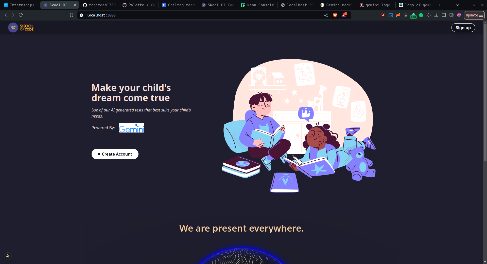
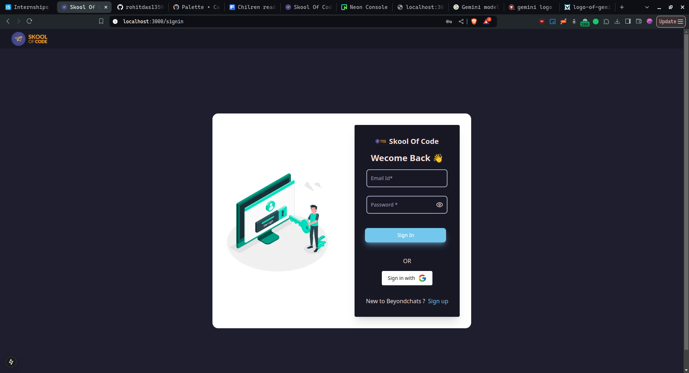
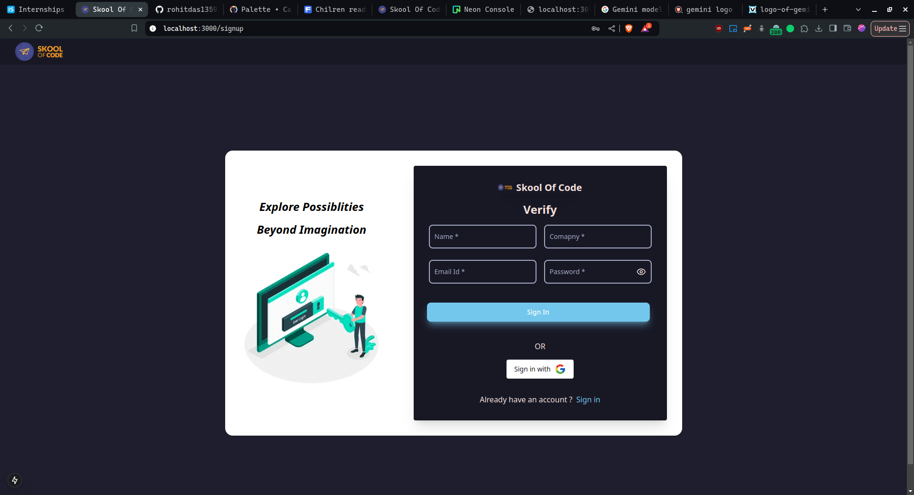
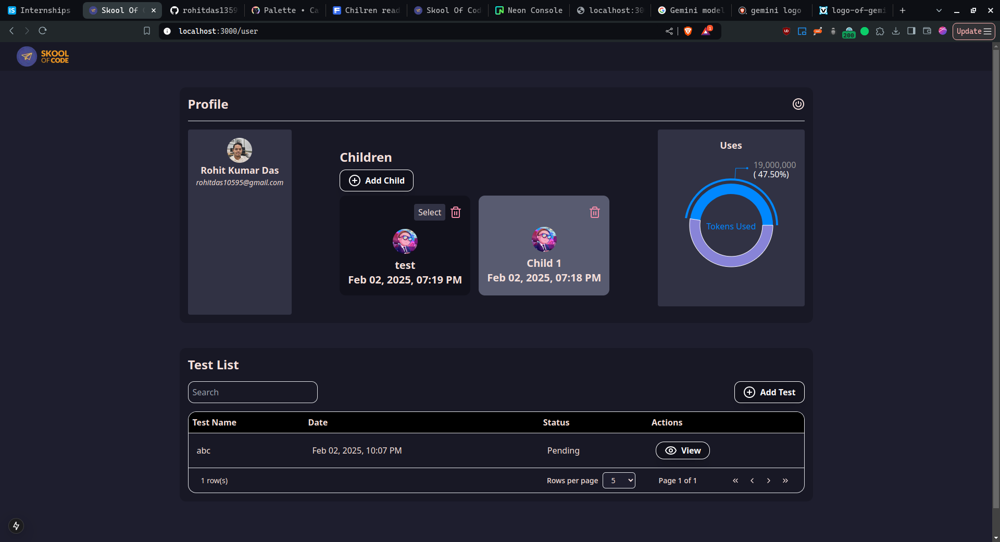
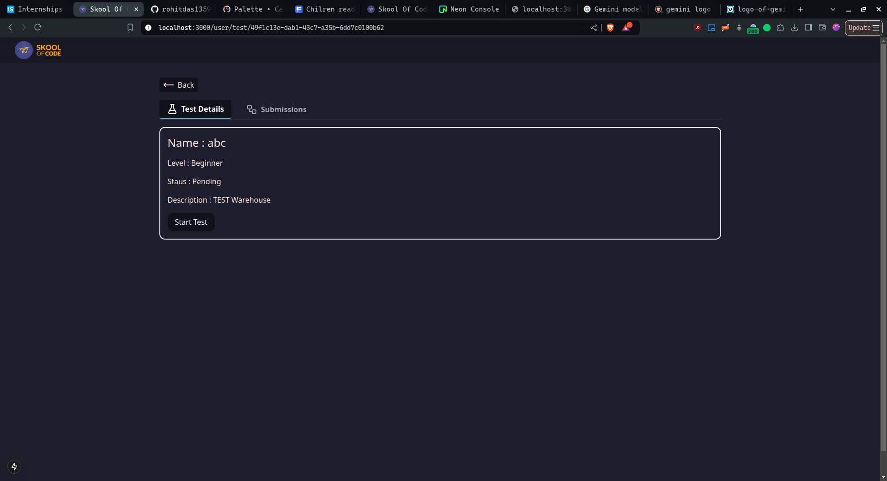
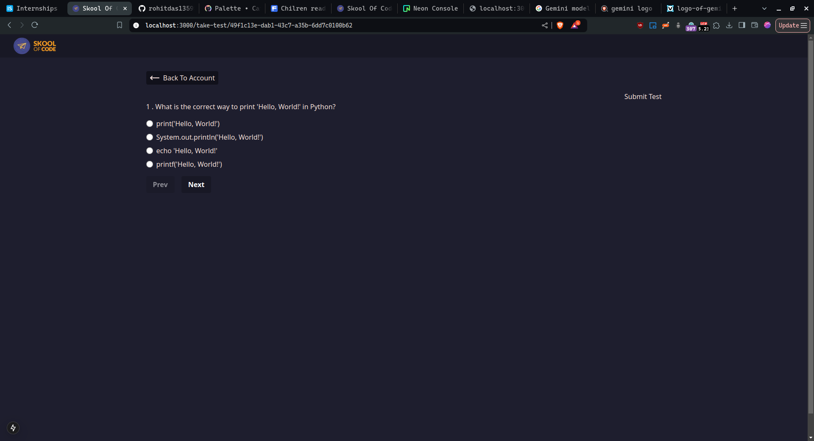

## Skool Of Code Assignment

#### Project Details

| Info             | Value                                     |
| ---------------- | ----------------------------------------- |
| Project Name     | Beyond Chats Assignment                   |
| Hosting Provider | Vercel                                    |
| URL              | https://skc-rohit-kumar-das-qb.vercel.app |
| Author           | Rohit Kumar Das                           |
| email            | contact@rohituno.com                      |

#### Tech Stack

| sl  | feature    | name               | desc                                      |
| --- | ---------- | ------------------ | ----------------------------------------- |
| 1   | db         | psql               | free tier neon db                         |
| 2   | framework  | Next Js            | React Js  Framework by vercel             |
| 3   | language   | Typescript         |                                           |
| 4   | auth       | Google, Credential | provided by NextAuth,  supports  Oauth2.0 |
| 5   | auth token | JWT                |                                           |
| 6   | ORM        | Drizzle ORM        |                                           |

#### DB schema

```ts
import {
  pgSchema,
  uuid,
  varchar,
  text,
  timestamp,
  pgTable,
  PgEnumColumn,
  boolean,
  json,
  integer,
} from "drizzle-orm/pg-core";
import { sql } from "drizzle-orm";
import { int } from "drizzle-orm/mysql-core";

export const User = pgTable("users", {
  id: uuid("id").primaryKey().defaultRandom().notNull(),
  name: varchar("name", { length: 255 }),
  email: varchar("email", { length: 255 }).notNull().unique(),
  password: varchar("password", { length: 255 }),
  isVerified: boolean("is_verified").default(false),
  signUpType: varchar("sign_up_type", {
    length: 255,
    enum: ["password", "google"],
  }),
  logo: varchar("logo", { length: 500 }),
  createdAt: timestamp("created_at").defaultNow().notNull(),
  updatedAt: timestamp("updated_at")
    .defaultNow()
    .notNull()
    .$onUpdateFn(() => sql`update users set updated_at = CURRENT_TIMESTAMP`),
});

export const Child = pgTable("child", {
  id: uuid("id").primaryKey().defaultRandom().notNull(),
  name: varchar("name", { length: 255 }),
  parentId: uuid("parent_id")
    .notNull()
    .references(() => User.id, { onDelete: "cascade" }),
  age: integer("age"),
  createdAt: timestamp("created_at").defaultNow().notNull(),
  updatedAt: timestamp("updated_at")
    .defaultNow()
    .notNull()
    .$onUpdateFn(() => sql`update users set updated_at = CURRENT_TIMESTAMP`),
});

export const Test = pgTable("test", {
  id: uuid("id").primaryKey().defaultRandom().notNull(),
  language: varchar("language", { length: 255 }),
  level: varchar("level", { length: 255 }),
  childId: uuid("child_id")
    .notNull()
    .references(() => Child.id, { onDelete: "cascade" }),
  name: varchar("name", { length: 255 }),
  description: varchar("description", { length: 255 }),
  status: varchar("status", {
    length: 255,
    enum: ["pending", "in-progress", "completed"],
  }),
  createdAt: timestamp("created_at").defaultNow().notNull(),
  updatedAt: timestamp("updated_at")
    .defaultNow()
    .notNull()
    .$onUpdateFn(() => sql`update users set updated_at = CURRENT_TIMESTAMP`),
});

export const Question = pgTable("question", {
  id: integer().primaryKey().generatedAlwaysAsIdentity(),
  testId: uuid("test_id")
    .notNull()
    .references(() => Test.id, { onDelete: "cascade" }),
  question: varchar("question", { length: 255 }),
  options: json("options"),
  answer: varchar("answer", { length: 255 }),
  createdAt: timestamp("created_at").defaultNow().notNull(),
  updatedAt: timestamp("updated_at")
    .defaultNow()
    .notNull()
    .$onUpdateFn(() => sql`update users set updated_at = CURRENT_TIMESTAMP`),
});

export const TestSubmission = pgTable("test_submission", {
  id: uuid("id").primaryKey().defaultRandom().notNull(),
  testId: uuid("test_id")
    .notNull()
    .references(() => Test.id, { onDelete: "cascade" }),
  childId: uuid("child_id")
    .notNull()
    .references(() => Child.id, { onDelete: "cascade" }),
  name: varchar("name", { length: 255 }),
  description: varchar("description", { length: 255 }),
  total: integer("total"),
  correct: integer("correct"),
  createdAt: timestamp("created_at").defaultNow().notNull(),
  updatedAt: timestamp("updated_at")
    .defaultNow()
    .notNull()
    .$onUpdateFn(() => sql`update users set updated_at = CURRENT_TIMESTAMP`),
});

export const SubmittedAnswer = pgTable("submitted_answer", {
  id: uuid("id").primaryKey().defaultRandom().notNull(),
  testId: uuid("test_id")
    .notNull()
    .references(() => Test.id, { onDelete: "cascade" }),
  questionId: integer("question_id")
    .notNull()
    .references(() => Question.id, { onDelete: "cascade" }),
  testSubmissionId: uuid("test_submission_id")
    .notNull()
    .references(() => TestSubmission.id, { onDelete: "cascade" }),
  answer: varchar("answer", { length: 255 }),
  correctAnswer: varchar("correct_answer", { length: 255 }),
  isCorrect: boolean("is_correct").default(false),
  createdAt: timestamp("created_at").defaultNow().notNull(),
  updatedAt: timestamp("updated_at")
    .defaultNow()
    .notNull()
    .$onUpdateFn(() => sql`update users set updated_at = CURRENT_TIMESTAMP`),
});
```

#### Back End Methods

- [x] API routes
- [x] Server Actions

#### Tree Structure

```bash
├── components.json
├── drizzle.config.ts
├── eslint.config.mjs
├── next.config.ts
├── next-env.d.ts
├── output
├── package.json
├── package-lock.json
├── postcss.config.mjs
├── public
│   ├── file.svg
│   ├── globe.svg
│   ├── illustrations
│   │   ├── home.svg
│   │   ├── login.png
│   │   └── login.svg
│   ├── images
│   │   ├── gemini.jpg
│   │   ├── google.svg
│   │   └── logo.png
│   ├── next.svg
│   ├── vercel.svg
│   └── window.svg
├── README.md
├── src
│   ├── app
│   │   ├── api
│   │   │   ├── auth
│   │   │   │   └── [...nextauth]
│   │   │   │       └── route.tsx
│   │   │   └── route.ts
│   │   ├── globals.css
│   │   ├── icon.png
│   │   ├── layout.tsx
│   │   ├── page.tsx
│   │   ├── signin
│   │   │   └── page.tsx
│   │   ├── signup
│   │   │   └── page.tsx
│   │   ├── take-test
│   │   │   └── [id]
│   │   │       └── page.tsx
│   │   └── user
│   │       ├── page.tsx
│   │       └── test
│   │           └── [id]
│   │               └── page.tsx
│   ├── auth.ts
│   ├── components
│   │   ├── devices
│   │   │   └── desktop.tsx
│   │   ├── input
│   │   │   └── OtpInput.tsx
│   │   ├── loader
│   │   │   └── spinner.tsx
│   │   ├── modal
│   │   │   └── modal.tsx
│   │   ├── nav
│   │   │   ├── navbar.tsx
│   │   │   └── signupButton.tsx
│   │   ├── sign
│   │   │   ├── signFormFilelds.tsx
│   │   │   ├── signInForm.tsx
│   │   │   └── signUpForm.tsx
│   │   ├── test
│   │   │   ├── main.tsx
│   │   │   ├── styles.module.css
│   │   │   ├── submission.tsx
│   │   │   ├── takeTest.tsx
│   │   │   └── test.tsx
│   │   ├── ui
│   │   │   ├── button
│   │   │   │   └── interactiveButton.tsx
│   │   │   ├── confetti.tsx
│   │   │   └── globe.tsx
│   │   └── user
│   │       ├── addChild.tsx
│   │       ├── addTest.tsx
│   │       ├── childList.tsx
│   │       ├── dataPagination.tsx
│   │       ├── dataTable.tsx
│   │       ├── defaultComponent.tsx
│   │       ├── profile.tsx
│   │       ├── testList.tsx
│   │       ├── user.module.css
│   │       └── uses.tsx
│   ├── lib
│   │   ├── actions
│   │   │   ├── auth.action.ts
│   │   │   ├── child.action.ts
│   │   │   ├── question.action.tsx
│   │   │   ├── submittedAnswers.action.ts
│   │   │   ├── test.action.ts
│   │   │   ├── test.submission.ts
│   │   │   └── user.action.ts
│   │   ├── db
│   │   │   ├── connection.ts
│   │   │   ├── migrate.ts
│   │   │   ├── migrations
│   │   │   │   ├── 0000_cultured_malice.sql
│   │   │   │   ├── 0001_colorful_whirlwind.sql
│   │   │   │   ├── 0002_abandoned_siren.sql
│   │   │   │   ├── 0003_pale_speed_demon.sql
│   │   │   │   ├── 0004_awesome_hulk.sql
│   │   │   │   ├── 0005_messy_magdalene.sql
│   │   │   │   └── meta
│   │   │   │       ├── 0000_snapshot.json
│   │   │   │       ├── 0001_snapshot.json
│   │   │   │       ├── 0002_snapshot.json
│   │   │   │       ├── 0003_snapshot.json
│   │   │   │       ├── 0004_snapshot.json
│   │   │   │       ├── 0005_snapshot.json
│   │   │   │       └── _journal.json
│   │   │   └── schema.ts
│   │   ├── gemini.ts
│   │   ├── helpers.ts
│   │   ├── settings
│   │   │   └── settings.ts
│   │   └── utils.ts
│   └── middleware.ts
├── tailwind.config.ts
└── tsconfig.json
```

#### Output Screenshots

Landing Page



Sign In Page



SignUp Page



User Dashboard



Test Pages




